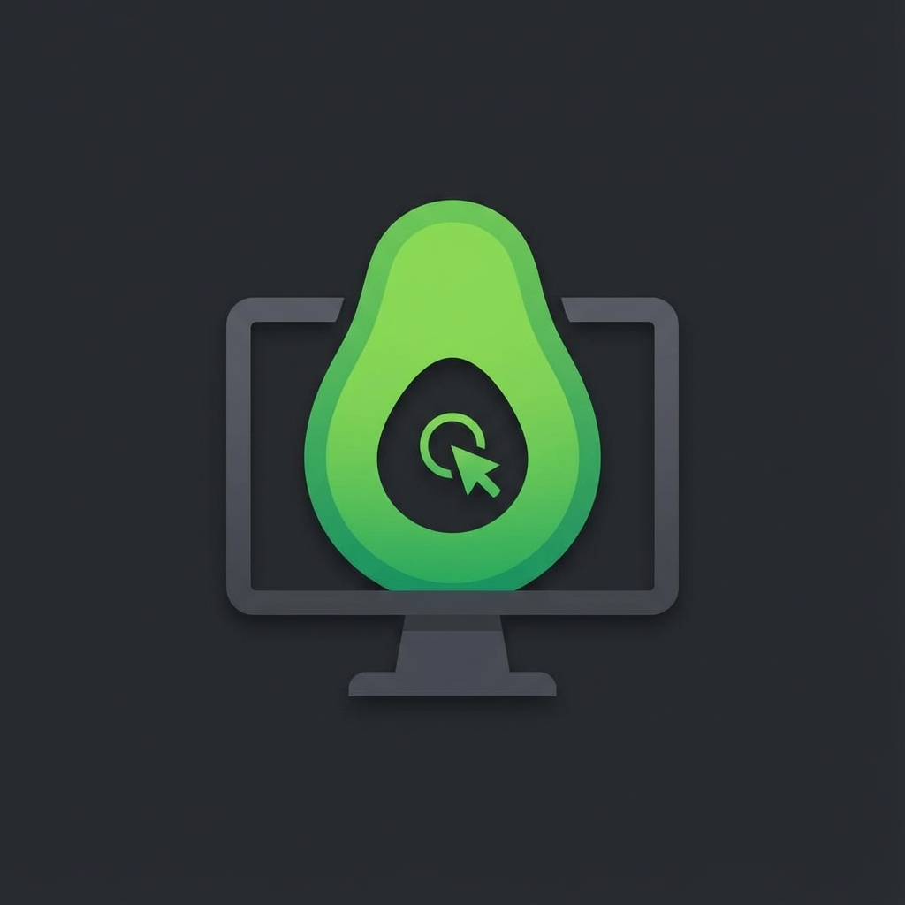

# Guacamole Wrapper

A native Windows desktop application that wraps the Apache Guacamole web interface using Electron. This application provides a standalone, chromium-based experience for accessing your Guacamole server with configurable settings and performance optimizations.



## Features

✨ **Native Desktop Experience** - Runs as a standalone Windows application with its own dedicated Chromium engine

⚙️ **Configurable Settings** - Easy-to-use settings interface for customizing your experience

🌐 **Custom Server URL** - Point to any Guacamole server (defaults to `http://localhost:8080/guacamole`)

🚀 **Hardware Acceleration** - Toggle GPU rendering for optimal performance

📡 **Network Priority Mode** - Prevents connection throttling when the app is minimized

🔗 **Quick Access** - Direct link to the project repository

## Technical Details

### Built With

- **Electron** - Cross-platform desktop application framework
- **electron-store** - Persistent settings storage
- **electron-builder** - Application packaging for Windows

### Architecture

- **main.js** - Main process that manages the application lifecycle and window creation
- **preload.js** - Secure IPC bridge between main and renderer processes
- **index.html** - Main window that loads the Guacamole interface
- **settings.html** - Settings interface for configuration
- **settings.js** - Settings window logic and form handling
- **styles.css** - Modern, dark-themed UI styling

## Installation & Setup

### Prerequisites

- Node.js (v16 or higher)
- npm (comes with Node.js)

### 1. Clone the Repository

```bash
git clone https://github.com/Saarthaksr7/Guacamole-rapper.git
cd Guacamole-rapper
```

### 2. Install Dependencies

```bash
npm install
```

This will install:
- Electron framework
- electron-store for settings persistence
- electron-builder for packaging

### 3. Run in Development Mode

```bash
npm start
# or
npm run dev
```

The application will launch and attempt to connect to your Guacamole server.

## Building the .exe

To create a standalone Windows executable:

```bash
npm run build
```

This will:
1. Package the application using electron-builder
2. Create an installer in the `dist/` directory
3. Generate both the installer (.exe) and unpacked files

The installer will be named something like `Guacamole Wrapper Setup 1.0.0.exe`

### Build Options

- **Full installer**: `npm run build` (creates NSIS installer)
- **Portable version**: `npm run build:dir` (creates unpacked directory without installer)

## Settings Configuration

Access settings via:
- **Menu**: File → Settings
- **Keyboard**: `Ctrl+,` (or `Cmd+,` on Mac)

### Available Settings

#### Target URL
- **Description**: The address of your Guacamole server
- **Default**: `http://localhost:8080/guacamole`
- **Format**: Must be a valid HTTP or HTTPS URL
- **Effect**: Loads immediately after saving

#### Hardware Acceleration
- **Description**: Uses GPU for rendering (improves performance)
- **Default**: Enabled
- **Effect**: **Requires application restart to take effect**
- **Note**: Disable if you experience graphical glitches

#### Network Priority (High Performance Mode)
- **Description**: Prevents the OS from throttling network activity when the app is minimized
- **Default**: Disabled
- **Effect**: Applies immediately
- **Technical**: Sets `backgroundThrottling: false` in Electron

#### Repository Link
- **Description**: Opens the GitHub repository in your default browser
- **Link**: https://github.com/Saarthaksr7/Guacamole-rapper

## Usage

1. **Launch the App** - Double-click the application icon or .exe
2. **Configure Settings** - On first launch, set your Guacamole server URL
3. **Access Guacamole** - The main window loads your Guacamole interface
4. **Manage Settings** - Use File → Settings or `Ctrl+,` to adjust configuration

### Keyboard Shortcuts

- `Ctrl+,` - Open Settings
- `Ctrl+R` - Reload Guacamole interface
- `F12` - Toggle Developer Tools
- `Ctrl+0` - Reset zoom to 100%
- `Ctrl++` - Zoom in
- `Ctrl+-` - Zoom out
- `Alt+F4` - Exit application

## Application Menu

### File
- Settings - Configure application preferences
- Reload - Refresh the Guacamole interface
- Exit - Close the application

### View
- Toggle Developer Tools - Open Chromium DevTools for debugging
- Zoom controls - Adjust interface zoom level

### Help
- Visit Repository - Open project GitHub page
- About - View application information

## How It Works

### Wrapper Architecture

The application uses Electron to embed a full Chromium browser engine, effectively giving you a dedicated Chrome instance for Guacamole:

1. **Main Process** (`main.js`) - Manages application lifecycle, creates windows, and handles settings
2. **Preload Script** (`preload.js`) - Provides secure IPC communication between processes
3. **Renderer Process** - Runs the UI (both main window and settings window)

### Settings Persistence

Settings are stored locally using `electron-store`, which creates a JSON file in your system's application data directory:

- Windows: `%APPDATA%\guacamole-rapper\config.json`

### Hardware Acceleration

Hardware acceleration must be disabled **before** the app initializes Chromium. That's why:
- The setting is checked immediately when `main.js` starts
- Changing it requires a restart
- The app provides a convenient "Restart Now" button

### Network Priority

When enabled, this setting:
- Sets `backgroundThrottling: false` on the main window
- Prevents the OS from slowing down network requests when minimized
- Keeps your remote desktop connection responsive even when alt-tabbed

## Troubleshooting

### App won't load Guacamole

1. Verify your Guacamole server is running
2. Check the Target URL in Settings is correct
3. Try accessing the URL in a regular browser first
4. Check for firewall/network issues

### Black screen or graphical glitches

1. Try disabling Hardware Acceleration in Settings
2. Restart the application
3. Update your graphics drivers

### Settings not saving

1. Ensure the app has write permissions to your AppData folder
2. Try running as administrator
3. Check for antivirus interference

### Can't connect when minimized

1. Enable "Network Priority (High Performance Mode)" in Settings
2. This prevents Windows from throttling the connection

## Development

### Project Structure

```
Guacamole-rapper/
├── main.js              # Main Electron process
├── preload.js           # IPC security bridge
├── index.html           # Main window (Guacamole interface)
├── settings.html        # Settings window UI
├── settings.js          # Settings window logic
├── styles.css           # Application styling
├── icon.png             # Application icon
├── package.json         # Project configuration
└── README.md            # This file
```

### Building from Source

```bash
# Install dependencies
npm install

# Run in development
npm run dev

# Build for production
npm run build

# Build without installer (faster for testing)
npm run build:dir
```

## Contributing

Contributions are welcome! Please feel free to submit a Pull Request.

## License

MIT License - See repository for details

## Author

**Saarthaksr7**
- GitHub: [@Saarthaksr7](https://github.com/Saarthaksr7)
- Repository: [Guacamole-rapper](https://github.com/Saarthaksr7/Guacamole-rapper)

## Acknowledgments

- Built with [Electron](https://www.electronjs.org/)
- For use with [Apache Guacamole](https://guacamole.apache.org/)
- Settings storage via [electron-store](https://github.com/sindresorhus/electron-store)

---

**Note**: This is a wrapper application for Apache Guacamole. You still need a functioning Guacamole server to connect to. This application does not include or bundle the Guacamole server itself.
